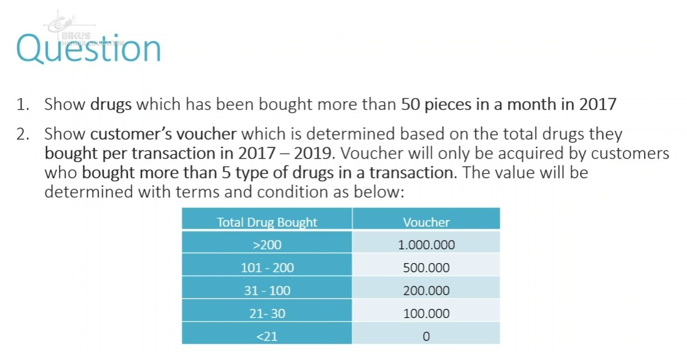

# 🚀 BELAJAR QUIZ SESSION 5 BIG DATA PROCESSING

## 📂 1. Pindahkan File `.csv` dan `.sql` ke Cloudera Desktop
Pindahkan file dari **Desktop Windows** ke **Desktop Cloudera** dengan **drag and drop**.

---

## 🖥️ 2. Buka Terminal dan Cek File
```bash
cd Desktop   # Pindah ke folder Desktop
ls           # Lihat isi file di Desktop
```

---

## 📤 3. Pindahkan File ke HDFS
Gunakan command `hadoop fs -copyFromLocal` untuk memindahkan file ke HDFS. Contoh untuk file `MsStore.csv`:
```bash
hadoop fs -copyFromLocal MsStore.csv /user/cloudera
```

---

## 🎛️ 4. Buat Database di Hue
Buka **Hue**, lalu buat database dengan command berikut:
```sql
CREATE DATABASE mydata;
```
Jika database belum muncul, lakukan **refresh** dengan memilih opsi **Invalidate all metadata and rebuild index**.

---

## 🏗️ 5. Buat Tabel untuk CSV
Ada dua tipe tabel:
- **Internal Table** 🏠 → Hanya digunakan di dalam sistem
- **External Table** 🌍 → Bisa digunakan di luar sistem

Contoh pembuatan **External Table**:
```sql
CREATE EXTERNAL TABLE msdrugtype(
   drugtypeid INT,
   drugtypename VARCHAR(255)
)
ROW FORMAT DELIMITED
FIELDS TERMINATED BY ','
STORED AS TEXTFILE 
TBLPROPERTIES ("skip.header.line.count"="1");
```
Lakukan eksekusi untuk semua tabel yang diperlukan.

📌 **Tip:** Gunakan `CTRL + SPACE` untuk autocomplete query di Hue!

---

## 🔒 6. Modifikasi Hak Akses File
Hak akses:
- **Read** 🧐 → `4`
- **Write** ✍ → `2`
- **Execute** 🚀 → `1`

Jika ingin memberikan akses penuh (`7 = 4+2+1`), jalankan command ini:
```bash
hadoop fs -chmod -R 777 /user/cloudera
```

---

## 📥 7. Load Data CSV ke Tabel di Hue
Gunakan command berikut untuk memasukkan data dari **HDFS** ke tabel **Hue**:
```sql
LOAD DATA INPATH '/user/cloudera/MsStore.csv' INTO TABLE msstore;
```
Lakukan langkah ini untuk semua tabel yang diperlukan.

---

## 🔍 8. Cek Data CSV di Hue
Gunakan query berikut untuk memastikan data telah masuk ke tabel:
```sql
SELECT * FROM msstore;
```

---

## 📂 9. Memindahkan File SQL
### ➡️ Langkah 1: Pindahkan ke MySQL
Jalankan command berikut di terminal untuk masuk ke mysql>:
```bash
MySQL -u root -p
```
Masukkan password: `cloudera`

Buat database untuk menampung data SQL:
```sql
CREATE DATABASE datas;
USE datas;
```
Pindahkan data dari local ke MySQL (Contoh namanya create+insert.sql):
```sql
source create+insert.sql;
```
Cek apakah tabel telah masuk:
```sql
SHOW TABLES;
SELECT * FROM `HeaderTransaction`;
```
Keluar dari MySQL:
```bash
exit
```

---

## 📤 10. Memindahkan Data dari MySQL ke Hadoop
Nama DB MySQL yg telah dibuat adalah `datas` dan DB di Hue/Hive adalah `mydata`
Gunakan command berikut untuk melakukan **import** ke Hadoop:
```bash
sudo sqoop import-all-tables --connect jdbc:mysql://quickstart:3306/datas --username=root -P --hive-import --hive-database=mydata
```
Masukkan password: `cloudera`

---

## 🔎 11. Cek Data di Hue
Pastikan data telah masuk dengan melakukan **refresh** dan menjalankan query berikut:
```sql
SELECT * FROM detailtransaction;
```
Lakukan langkah ini untuk tabel lainnya.

---

## 🧐 12. Mulai Query dan Analisis Data
Gunakan SQL untuk melakukan analisis data sesuai soal.

### 📝 Contoh Soal:

#### 1️⃣ **Jumlah Pembelian Obat di Tahun 2017**
```sql
SELECT drugname, SUM(quantity) AS TotalPurchased
FROM msdrug
JOIN detailtransaction
ON detailtransaction.drugid = msdrug.drugid
JOIN headertransaction
ON detailtransaction.transactionid = headertransaction.transactionid
WHERE YEAR(transactiondate) = 2017
GROUP BY drugname, MONTH(transactiondate)
HAVING SUM(quantity) > 50;
```

#### 2️⃣ **Perhitungan Voucher Berdasarkan Total Pembelian**
```sql
SELECT customername,
(
CASE
    WHEN SUM(quantity) > 200 THEN 1000000
    WHEN SUM(quantity) > 100 THEN 500000
    WHEN SUM(quantity) > 30 THEN 200000
    WHEN SUM(quantity) > 20 THEN 100000
    ELSE 0
END
) AS VoucherObtained
FROM mscustomer
JOIN headertransaction
ON headertransaction.customerid = mscustomer.customerid
JOIN detailtransaction
ON detailtransaction.transactionid = headertransaction.transactionid
WHERE YEAR(transactiondate) BETWEEN 2017 AND 2019
GROUP BY customername, headertransaction.transactionid, transactiondate
HAVING COUNT(headertransaction.transactionid) > 5;
```

---

🚀 **Selesai!** Semoga nilainya bagus hall yeah hall yeah! 🎉

